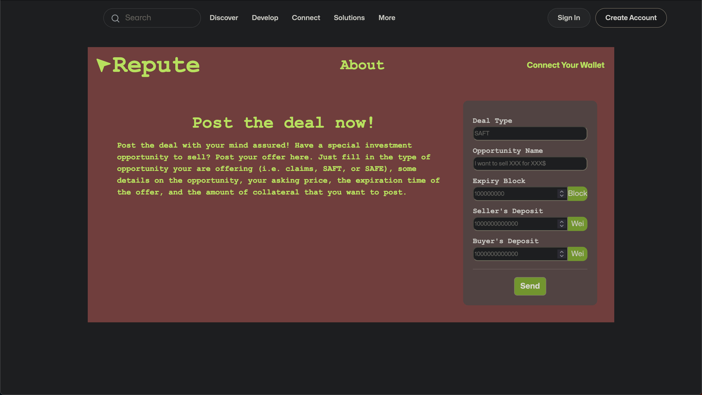

# Web3-BUILD-Hackathon

## Inspiration:

Discovering new possibilities in the world of non-liquid assets, we were inspired to create Repute. Our goal was to revolutionize the way special situations opportunities are traded, providing a trustless and transparent solution for individuals and businesses alike.

## What it does:

Repute is a game-changing platform that introduces a non-custodial OTC escrow service for special situations opportunities. From bankruptcy claims to SAFT/SAFE agreements and beyond, Repute facilitates the seamless trading of off-chain assets through secure and immutable smart contracts. Our platform empowers users to engage in transactions without the need for intermediaries, eliminating the risks associated with traditional escrow agents.

## How we built it:

To bring Repute to life, we employed the ETHScaffold framework as our foundation. Leveraging the power of Hardhat for smart contract development and Next JS for the front-end, we meticulously crafted a robust and user-friendly platform. We integrated the Worldcoin widget to enable address verification, ensuring enhanced security for all users. The deployment of our smart contract on Polygon Mumbai via QuickNode RPC allowed us to leverage the benefits of a high-performance network.

## Challenges we ran into:

Throughout the development process, we encountered various challenges that pushed us to find innovative solutions. One of the primary hurdles was designing a system that could handle the complexities of trading non-liquid assets, such as navigating different jurisdictions and accommodating small-ticket sizes. Additionally, ensuring the integration of the Worldcoin widget seamlessly with our platform posed its own set of technical challenges.

## Accomplishments that we're proud of:

We take great pride in several key accomplishments we achieved with Repute. First and foremost, we successfully built a trustless platform that empowers users to trade special situations opportunities without the need for intermediaries. Our integration of Worldcoin's gated protocol prepares the platform for future compliance with KYC/AML regulations. Furthermore, we developed a robust and scalable smart contract architecture that ensures transparency and security for all transactions.

## What we learned:

The journey of creating Repute was a valuable learning experience for our team. We gained a deeper understanding of the complexities surrounding the trading of non-liquid assets and the challenges that arise in special situations. Through extensive research and development, we honed our skills in smart contract deployment, address verification, and integrating external tools to enhance the functionality of our platform.

## What's next for Repute:

Looking ahead, our vision for Repute is to continue expanding and refining our platform. We aim to enhance the user experience by implementing additional features and improvements based on user feedback. We will explore partnerships with other blockchain projects to broaden the scope of tradable assets on our platform. Moreover, we plan to actively engage with regulators and compliance experts to ensure Repute remains at the forefront of trustless trading while adhering to evolving legal requirements.
